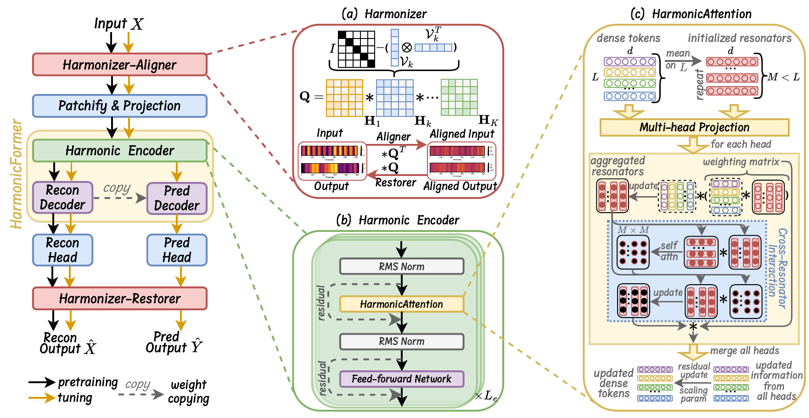

# Olivia (ICML 2026)

The repo is the official implementation for the paper: **Olivia: Harmonizing Time Series Foundation Models  with Power Spectral Density**.


## 🌟 Introduction
Time series foundation models rely on large-scale pretraining over diverse datasets across domains, yet their heterogeneity in temporal patterns could hinder the effectiveness of training and learning transferable time series representations. 
Inspired a fundamental concept, normalized power spectral density (PSD) in signal processing, we assume harmonizing datasets via PSDs in the spectral domain could reduce mismatches and enhance pretraining. 
We then go beyond the direct intractable minimization optimization and innovatively reformulate it as a principled _harmonization_ approach. 
Specifically, we propose _Harmonizer_, a module that reshapes spectral structures and implicitly harmonizing PSDs across datasets, which theoretically corresponds to a shared reparameterization of second-order temporal correlations. 
Our theoretical analysis further reveals token interactions with Harmonizer can be efficiently mediated by a compact set of resonators, motivating a _HarmonicAttention_ design that performs self-attention in a low-dimensional interaction space. 
Then, we propose _Olivia_, a novel time series foundation model built upon these harmonization mechanisms. 
Extensive experiments on two large-scale benchmarks (TSLib and GIFT-Eval) and extra 6 datasets from GluonTS, demonstrate Olivia consistently achieves state-of-the-art performance under zero-shot, few-shot, and full-shot forecasting scenarios.


<p align="center">

</p>


## 👉 Usage 

1. Environment Requirements

Install Pytorch and necessary dependencies.
```
pip install -r requirements.txt
```

2. Prepare datasets

All datasets used for pretraining, tuning, and evaluation can be found in the following resources: [Google Drive](https://drive.google.com/file/d/1l51QsKvQPcqILT3DwfjCgx8Dsg2rpjot/view?usp=drive_link) and [Tsinghua Cloud](https://cloud.tsinghua.edu.cn/f/93868e3a9fb144fe9719/).


## 😊 Acknowledgements

We appreciate the following repos for their valuable code and efforts.
- uni2ts (https://github.com/SalesforceAIResearch/uni2ts)
- gift-eval (https://github.com/SalesforceAIResearch/gift-eval)
- Time-MoE (https://github.com/Time-MoE/Time-MoE)
- chronos-forecasting (https://github.com/amazon-science/chronos-forecasting)
- SEMPO (https://github.com/mala-lab/SEMPO)
- Time-Series-Library (https://github.com/thuml/Time-Series-Library)


